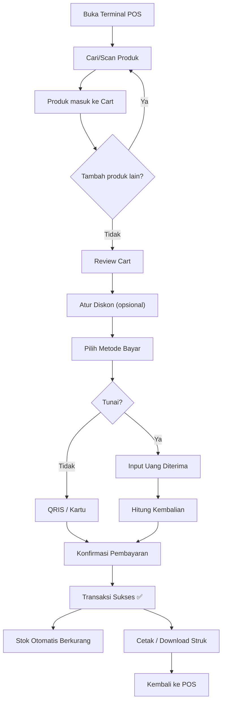
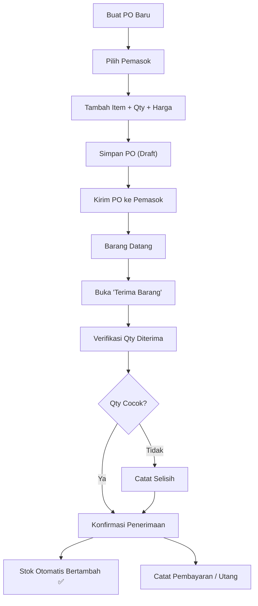

# Frontend Plan — POS Dashboard System

Dokumen ini mencakup arsitektur UI/UX, sistem navigasi, layout halaman, dan struktur komponen untuk frontend sistem POS Dashboard terintegrasi.

## Tech Stack

| Layer | Teknologi |
|---|---|
| Framework | React 18 + TypeScript |
| Build Tool | Vite 5 |
| Styling | Tailwind CSS 3 |
| UI Components | shadcn/ui (Radix UI) |
| Charting | Recharts |
| Routing | React Router v6 |
| State Management | Zustand (global) + React Query/TanStack Query (server state) |
| Form Handling | React Hook Form + Zod (validation) |
| Icons | Lucide React |
| Table | TanStack Table (sortable, filterable, paginated) |
| Date Picker | date-fns + shadcn date-picker |
| Notifications | Sonner (toast notifications) |

---

## 1. Sistem Navigasi & Information Architecture

### 1.1 Sitemap — Hierarki Halaman

```mermaid
graph TD
    ROOT["🏠 App Root"]

    ROOT --> AUTH["🔐 Auth"]
    AUTH --> LOGIN["Login"]

    ROOT --> MAIN["📋 Main Layout<br/>(Sidebar + Content)"]

    MAIN --> DASH["📊 Dashboard"]
    DASH --> DASH_OVERVIEW["Overview<br/>(default)"]
    DASH --> DASH_PL["Laporan Laba Rugi"]
    DASH --> DASH_CASHFLOW["Arus Kas"]

    MAIN --> PRODUCTS["📦 Produk"]
    PRODUCTS --> PROD_LIST["Daftar Produk"]
    PRODUCTS --> PROD_CREATE["Tambah Produk"]
    PRODUCTS --> PROD_EDIT["Edit Produk"]
    PRODUCTS --> PROD_DETAIL["Detail Produk"]
    PRODUCTS --> PROD_CAT["Kategori Produk"]
    PRODUCTS --> PROD_STOCK["Stok Opname"]

    MAIN --> POS["🛒 POS / Kasir"]
    POS --> POS_TERMINAL["Terminal POS"]
    POS --> POS_HISTORY["Riwayat Transaksi"]
    POS --> POS_RECEIPT["Detail Struk"]

    MAIN --> PURCHASE["🚚 Pembelian"]
    PURCHASE --> PO_LIST["Daftar PO"]
    PURCHASE --> PO_CREATE["Buat PO Baru"]
    PURCHASE --> PO_DETAIL["Detail PO"]
    PURCHASE --> PO_RECEIVE["Penerimaan Barang"]
    PURCHASE --> SUPPLIER["Manajemen Pemasok"]

    MAIN --> EXPENSE["💰 Pengeluaran"]
    EXPENSE --> EXP_LIST["Daftar Pengeluaran"]
    EXPENSE --> EXP_CREATE["Input Pengeluaran"]
    EXPENSE --> EXP_CAT["Kategori Beban"]

    MAIN --> REPORTS["📈 Laporan"]
    REPORTS --> RPT_SALES["Laporan Penjualan"]
    REPORTS --> RPT_PURCHASE["Laporan Pembelian"]
    REPORTS --> RPT_INVENTORY["Laporan Inventaris"]
    REPORTS --> RPT_EXPENSE["Laporan Pengeluaran"]
    REPORTS --> RPT_PL["Laba Rugi Lengkap"]

    MAIN --> SETTINGS["⚙️ Pengaturan"]
    SETTINGS --> SET_STORE["Profil Toko"]
    SETTINGS --> SET_TAX["Pajak & Diskon"]
    SETTINGS --> SET_PAYMENT["Metode Pembayaran"]
    SETTINGS --> SET_USERS["Manajemen Pengguna"]
```



### 1.2 Navigasi Desktop — Sidebar

Sidebar permanen di kiri layar (width `256px`, collapsible ke `64px` icon-only mode).

```
┌─────────────────────────────────────────────────────────┐
│ 🏪 Dreamfresh POS          [«]  ← collapse toggle       │
├─────────────────────────────────────────────────────────┤
│                                                         │
│  📊  Dashboard                                          │
│  ──────────────────                                     │
│  📦  Produk & Stok           → submenu expand           │
│      ├─ Daftar Produk                                   │
│      ├─ Kategori                                        │
│      └─ Stok Opname                                     │
│  🛒  POS / Kasir             → langsung ke terminal     │
│  🚚  Pembelian               → submenu expand           │
│      ├─ Purchase Order                                  │
│      ├─ Penerimaan Barang                               │
│      └─ Pemasok                                         │
│  💰  Pengeluaran             → submenu expand           │
│      ├─ Daftar Pengeluaran                              │
│      └─ Kategori Beban                                  │
│  📈  Laporan                 → submenu expand           │
│      ├─ Penjualan                                       │
│      ├─ Pembelian                                       │
│      ├─ Inventaris                                      │
│      ├─ Pengeluaran                                     │
│      └─ Laba Rugi                                       │
│  ──────────────────                                     │
│  ⚙️  Pengaturan                                         │
│                                                         │
├─────────────────────────────────────────────────────────┤
│  👤 Admin User          [🔔 3]  ← notif badge          │
│     admin@toko.com       [⏻]   ← logout                │
└─────────────────────────────────────────────────────────┘
```

**Perilaku Sidebar:**
- **Desktop (≥1024px):** Sidebar terbuka penuh, collapsible ke icon-only
- **Tablet (768px–1023px):** Sidebar default collapsed (icon-only), hover/klik expand
- **Mobile (<768px):** Sidebar tersembunyi, muncul sebagai *drawer overlay* saat hamburger menu diklik

### 1.3 Navigasi Mobile — Bottom Navigation

Pada layar `<768px`, sidebar diganti dengan **bottom navigation bar** berisi 5 item utama:

```
┌──────────────────────────────────────────┐
│                 Content Area             │
│                                          │
├──────────────────────────────────────────┤
│  🏠      📦      🛒      💰      ☰     │
│ Home   Produk    POS   Expense  More    │
└──────────────────────────────────────────┘
```

- **More (☰)** membuka *bottom sheet* berisi: Pembelian, Laporan, Pengaturan
- Item POS (🛒) diberi **aksen warna biru** lebih besar sebagai primary action

### 1.4 Top Bar / Header

```
┌────────────────────────────────────────────────────────────────┐
│  ☰ (mobile only)  │  📍 Breadcrumb: Dashboard > Overview     │
│                    │                                           │
│                    │          🔍 Global Search    🔔 3   👤    │
└────────────────────────────────────────────────────────────────┘
```

- **Breadcrumb** dinamis sesuai halaman aktif
- **Global Search** (shortcut `Ctrl+K`): command palette untuk cari produk, transaksi, PO
- **Notification Bell**: low stock alerts, PO pending, dll
- **User Avatar**: dropdown menu (profil, pengaturan, logout)

---

## 2. Layout & Wireframe Setiap Halaman

### 2.1 Dashboard Overview

```
┌─────────────────────────────────────────────────────────────┐
│  DASHBOARD OVERVIEW                   [Hari ini ▾] [Filter]│
├─────────────────────────────────────────────────────────────┤
│                                                             │
│  ┌──────────┐  ┌──────────┐  ┌──────────┐  ┌──────────┐   │
│  │ 💰 Omzet │  │ 📉 HPP   │  │ 💵 Laba  │  │ ⚠️ Low   │   │
│  │ Hari Ini │  │ Hari Ini │  │ Bersih   │  │ Stock    │   │
│  │ Rp 5.2jt │  │ Rp 3.1jt │  │ Rp 1.4jt │  │ 7 items  │   │
│  │ ↑12%     │  │ ↑8%      │  │ ↑18%     │  │ ⚠ Alert  │   │
│  └──────────┘  └──────────┘  └──────────┘  └──────────┘   │
│                                                             │
│  ┌────────────────────────────┐  ┌────────────────────────┐ │
│  │  📈 Grafik Penjualan      │  │  🏆 Produk Terlaris    │ │
│  │  (Line Chart - 30 hari)   │  │  (Bar Chart Horizontal)│ │
│  │                            │  │                        │ │
│  │  ~~~~~~~~~~~~~~~~~~~~~~~~  │  │  Produk A  ████████   │ │
│  │  ~    ~~~~                 │  │  Produk B  ██████     │ │
│  │  ~~        ~~~~            │  │  Produk C  █████      │ │
│  │                            │  │  Produk D  ████       │ │
│  │                            │  │  Produk E  ███        │ │
│  └────────────────────────────┘  └────────────────────────┘ │
│                                                             │
│  ┌────────────────────────────┐  ┌────────────────────────┐ │
│  │  💸 Arus Kas (Cash Flow)  │  │  🕐 Transaksi Terbaru  │ │
│  │  (Area Chart)             │  │  (Table - 10 terakhir) │ │
│  │                            │  │                        │ │
│  │  Masuk:  Rp 5.200.000     │  │  #001 Rp 150K  ✅      │ │
│  │  Keluar: Rp 3.800.000     │  │  #002 Rp 85K   ✅      │ │
│  │  Saldo:  Rp 1.400.000     │  │  #003 Rp 220K  ✅      │ │
│  └────────────────────────────┘  └────────────────────────┘ │
└─────────────────────────────────────────────────────────────┘
```

**Summary Cards:** 4 kartu KPI di atas, masing-masing menampilkan:
- Judul metrik
- Angka utama (formatted Rupiah)
- Persentase perubahan vs periode sebelumnya (warna hijau/merah)
- Ikon indikator

**Grid Layout:** 2 kolom di desktop, 1 kolom di mobile. Semua chart responsif.

---

### 2.2 Terminal POS (Kasir)

> [!IMPORTANT]
> Halaman POS memiliki layout **full-screen** tanpa sidebar untuk memaksimalkan ruang kerja kasir. Akses kembali ke dashboard via tombol "← Kembali" di pojok kiri atas.

```
┌─────────────────────────────────────────────────────────────────┐
│  [← Dashboard]     TERMINAL POS          Kasir: Ahmad    🕐    │
├───────────────────────────────────┬─────────────────────────────┤
│  🔍 Cari produk / scan barcode   │   KERANJANG BELANJA         │
│  ┌─────────────────────────────┐  │                             │
│  │  [Semua] [Makanan] [Minum] │  │  ┌─────────────────────────┐│
│  │  ← tab kategori filter →   │  │  │ 1. Indomie Goreng       ││
│  └─────────────────────────────┘  │  │    2 × Rp 3.500 = 7.000││
│                                   │  │ 2. Es Teh Manis         ││
│  ┌────────┐ ┌────────┐ ┌──────┐  │  │    1 × Rp 5.000 = 5.000││
│  │ 🖼️     │ │ 🖼️     │ │ 🖼️   │  │  │ 3. Roti Bakar          ││
│  │Indomie │ │ Mie    │ │Beras │  │  │    1 × Rp 12.000=12.000││
│  │Goreng  │ │Sedaap  │ │5kg   │  │  └─────────────────────────┘│
│  │Rp3.500 │ │Rp3.200 │ │Rp65K │  │                             │
│  │stk: 45 │ │stk: 32 │ │stk:8 │  │  ──────────────────────────│
│  └────────┘ └────────┘ └──────┘  │  Subtotal:      Rp 24.000  │
│  ┌────────┐ ┌────────┐ ┌──────┐  │  Diskon (10%):  -Rp 2.400  │
│  │ 🖼️     │ │ 🖼️     │ │ 🖼️   │  │  PPN (11%):    +Rp 2.376  │
│  │ Es Teh │ │Roti    │ │Sabun │  │  ──────────────────────────│
│  │ Manis  │ │Bakar   │ │Cuci  │  │  TOTAL:        Rp 23.976  │
│  │Rp5.000 │ │Rp12K   │ │Rp8.5K│  │                             │
│  │stk: 60 │ │stk: 15 │ │stk:22│  │  ┌─────┐ ┌─────┐ ┌──────┐│
│  └────────┘ └────────┘ └──────┘  │  │💵    │ │📱   │ │💳    ││
│                                   │  │Tunai │ │QRIS │ │Kartu ││
│  ← Pagination / Load More →      │  └─────┘ └─────┘ └──────┘│
│                                   │                             │
│                                   │  [🖨️ BAYAR & CETAK STRUK]  │
└───────────────────────────────────┴─────────────────────────────┘
```

**Split Layout:**
- **Kiri (60%):** Grid produk + pencarian/filter/barcode
- **Kanan (40%):** Cart + kalkulasi + payment actions
- **Mobile:** Full screen cart sebagai *bottom sheet* yang bisa ditarik ke atas

**Interaksi:**
- Klik produk → tambah ke cart (qty +1)
- Long press / klik qty → edit jumlah manual
- Swipe item di cart → hapus
- Scan barcode → auto-add ke cart
- Setelah "Bayar" → modal konfirmasi → print/download struk

---

### 2.3 Manajemen Produk & Stok

#### Daftar Produk
```
┌──────────────────────────────────────────────────────────────┐
│  DAFTAR PRODUK                   [+ Tambah Produk] [Export] │
├──────────────────────────────────────────────────────────────┤
│  🔍 Cari...   [Kategori ▾]  [Status Stok ▾]  [Urutkan ▾]  │
├──────────────────────────────────────────────────────────────┤
│  ☐ │ 🖼️ │ SKU     │ Nama Produk    │ Kategori │ Harga Jual │
│    │    │         │                │          │            │
│  ☐ │ 📷 │ SKU-001 │ Indomie Goreng │ Makanan  │ Rp 3.500   │
│    │    │         │  Stok: 45 ✅    │          │            │
│  ☐ │ 📷 │ SKU-002 │ Beras Premium  │ Sembako  │ Rp 65.000  │
│    │    │         │  Stok: 3  ⚠️    │          │            │
│  ☐ │ 📷 │ SKU-003 │ Sabun Cuci     │ Rumah    │ Rp 8.500   │
│    │    │         │  Stok: 0  🔴    │          │            │
├──────────────────────────────────────────────────────────────┤
│  Menampilkan 1-10 dari 156        [← 1  2  3  4  5 →]     │
└──────────────────────────────────────────────────────────────┘
```

#### Form Tambah/Edit Produk

```
┌──────────────────────────────────────────────────────────────┐
│  TAMBAH PRODUK BARU                         [✕ Batal]      │
├──────────────────────────────────────────────────────────────┤
│                                                              │
│  ┌─────────────────────────┐  ┌────────────────────────────┐│
│  │  Informasi Dasar        │  │  Foto Produk               ││
│  │                         │  │  ┌──────────────────────┐  ││
│  │  Nama Produk *          │  │  │                      │  ││
│  │  [________________]     │  │  │   📷 Upload Foto     │  ││
│  │                         │  │  │   atau drag & drop   │  ││
│  │  SKU *                  │  │  │                      │  ││
│  │  [________________]     │  │  └──────────────────────┘  ││
│  │                         │  │                            ││
│  │  Kategori *             │  │  Pengaturan Stok           ││
│  │  [Pilih kategori  ▾]   │  │                            ││
│  │                         │  │  Stok Awal                 ││
│  │  Deskripsi              │  │  [________________]        ││
│  │  [________________]     │  │                            ││
│  │  [________________]     │  │  Batas Minimum *           ││
│  │                         │  │  [________________]        ││
│  └─────────────────────────┘  └────────────────────────────┘│
│                                                              │
│  ┌──────────────────────────────────────────────────────────┐│
│  │  Harga                                                   ││
│  │                                                          ││
│  │  Harga Beli *              Harga Jual *                  ││
│  │  [Rp ____________]        [Rp ____________]              ││
│  │                                                          ││
│  │  Margin: 42.8%  (kalkulasi otomatis)                     ││
│  └──────────────────────────────────────────────────────────┘│
│                                                              │
│                          [Batal]  [💾 Simpan Produk]        │
└──────────────────────────────────────────────────────────────┘
```

---

### 2.4 Pembelian (Purchase Order)

#### Buat PO Baru
```
┌──────────────────────────────────────────────────────────────┐
│  BUAT PURCHASE ORDER               [Simpan Draft] [Kirim]  │
├──────────────────────────────────────────────────────────────┤
│                                                              │
│  Pemasok *: [Pilih pemasok ▾]     No. PO: PO-2026-0045     │
│  Tanggal : [04 Sep 2026   📅]    Status: 🟡 Draft          │
│  Catatan : [________________]                                │
│                                                              │
│  ─── ITEM PEMBELIAN ────────────────────────────────────────│
│  │ # │ Produk          │ Qty │ Harga Beli │ Subtotal      │ │
│  │ 1 │ Indomie Goreng  │ 100 │ Rp 2.800   │ Rp 280.000   │ │
│  │ 2 │ Beras Premium   │  20 │ Rp 55.000  │ Rp 1.100.000 │ │
│  │ 3 │ [+ Tambah Item] │     │            │              │ │
│  ├───┴─────────────────┴─────┴────────────┴──────────────┤ │
│  │                                  TOTAL: Rp 1.380.000  │ │
│  └───────────────────────────────────────────────────────┘ │
└──────────────────────────────────────────────────────────────┘
```

#### Penerimaan Barang
```
┌──────────────────────────────────────────────────────────────┐
│  PENERIMAAN BARANG — PO-2026-0045             [✓ Terima]   │
├──────────────────────────────────────────────────────────────┤
│  Pemasok: PT Indofood     │  Tanggal Terima: [04 Sep 2026] │
│                                                              │
│  │ Produk          │ Dipesan │ Diterima │ Selisih │ Status │ │
│  │ Indomie Goreng  │   100   │ [  98 ]  │   -2    │ ⚠️     │ │
│  │ Beras Premium   │    20   │ [  20 ]  │    0    │ ✅     │ │
│                                                              │
│  Catatan Penerimaan: [________________________________]     │
│                                                              │
│  ┌ Metode Pembayaran ──────────────────────────────────────┐│
│  │ ○ Lunas   ○ Utang (Jatuh tempo: [________📅])         ││
│  └─────────────────────────────────────────────────────────┘│
└──────────────────────────────────────────────────────────────┘
```

---

### 2.5 Pengeluaran Operasional

```
┌──────────────────────────────────────────────────────────────┐
│  PENGELUARAN OPERASIONAL              [+ Input Pengeluaran] │
├──────────────────────────────────────────────────────────────┤
│  [Bulan ini ▾]  [Kategori ▾]        Total: Rp 8.450.000    │
├──────────────────────────────────────────────────────────────┤
│  │ Tanggal    │ Kategori    │ Deskripsi      │ Jumlah      │ │
│  │ 04 Sep 26  │ 🏠 Sewa     │ Sewa toko Sep  │ Rp 5.000.000│ │
│  │ 03 Sep 26  │ ⚡ Listrik  │ Token PLN      │ Rp 500.000  │ │
│  │ 01 Sep 26  │ 📦 Supplies │ Kantong plastik│ Rp 150.000  │ │
│  │ 01 Sep 26  │ 👤 Gaji     │ Gaji kasir Sep │ Rp 2.800.000│ │
└──────────────────────────────────────────────────────────────┘
```

**Modal Input Pengeluaran:**
```
┌────────────────────────────────────────┐
│  INPUT PENGELUARAN BARU         [✕]   │
├────────────────────────────────────────┤
│  Tanggal *                             │
│  [04 Sep 2026  📅]                     │
│                                        │
│  Kategori Beban *                      │
│  [Pilih kategori ▾]                   │
│                                        │
│  Deskripsi *                           │
│  [_________________________]           │
│                                        │
│  Jumlah (Rp) *                         │
│  [Rp ___________________]              │
│                                        │
│  Metode Pembayaran                     │
│  [Kas / Transfer ▾]                   │
│                                        │
│  Bukti Pembayaran                      │
│  [📎 Upload file (jpg, pdf)]          │
│                                        │
│         [Batal]  [💾 Simpan]          │
└────────────────────────────────────────┘
```

---

### 2.6 Laporan Laba Rugi

```
┌──────────────────────────────────────────────────────────────┐
│  LAPORAN LABA RUGI                   [Periode ▾] [📥 PDF]  │
├──────────────────────────────────────────────────────────────┤
│  Periode: September 2026                                    │
│                                                              │
│  ┌──────────────────────────────────────────────────────────┐│
│  │                                                          ││
│  │  PENDAPATAN                                              ││
│  │    Penjualan Kotor ........................ Rp 52.000.000││
│  │    Diskon Penjualan ....................... (Rp 2.400.000)││
│  │                                           ──────────────││
│  │    Penjualan Bersih ....................... Rp 49.600.000││
│  │                                                          ││
│  │  HARGA POKOK PENJUALAN (HPP)                            ││
│  │    HPP Barang Terjual .................... (Rp 31.200.000)││
│  │                                           ──────────────││
│  │    LABA KOTOR ............................. Rp 18.400.000││
│  │                                                          ││
│  │  BEBAN OPERASIONAL                                      ││
│  │    Sewa .................................. (Rp 5.000.000) ││
│  │    Gaji .................................. (Rp 5.600.000) ││
│  │    Listrik ............................... (Rp 1.200.000) ││
│  │    Perlengkapan .......................... (Rp   450.000) ││
│  │    Lain-lain ............................. (Rp   350.000) ││
│  │                                           ──────────────││
│  │    Total Beban Operasional .............. (Rp 12.600.000)││
│  │                                           ══════════════││
│  │    LABA BERSIH ............................ Rp  5.800.000││
│  │                                                          ││
│  └──────────────────────────────────────────────────────────┘│
│                                                              │
│  ┌──────────────────────────────────────────────────────────┐│
│  │  📊 Grafik Perbandingan Bulanan (Bar Chart)             ││
│  │  [Pendapatan] vs [HPP] vs [Beban] vs [Laba Bersih]     ││
│  │                                                          ││
│  │  ████                                                    ││
│  │  ████  ████                                              ││
│  │  ████  ████  ████                                        ││
│  │  ████  ████  ████  ████                                  ││
│  │  Jun   Jul   Agu   Sep                                   ││
│  └──────────────────────────────────────────────────────────┘│
└──────────────────────────────────────────────────────────────┘
```

---

## 3. Design System & Tema Visual

### 3.1 Color Palette — Profesional Navy

| Token | Hex | Penggunaan |
|---|---|---|
| `primary-900` | `#0F172A` | Sidebar background |
| `primary-800` | `#1E293B` | Sidebar hover |
| `primary-700` | `#334155` | Sidebar active item |
| `primary-600` | `#1E40AF` | Primary buttons, links |
| `primary-500` | `#3B82F6` | Button hover, badges |
| `primary-100` | `#DBEAFE` | Light accents, tag bg |
| `background` | `#F8FAFC` | Page background |
| `surface` | `#FFFFFF` | Cards, tables, modals |
| `text-primary` | `#0F172A` | Headings, body text |
| `text-secondary` | `#64748B` | Labels, captions |
| `success` | `#16A34A` | Positif, stok OK |
| `warning` | `#F59E0B` | Low stock, pending |
| `danger` | `#DC2626` | Stok habis, error |
| `border` | `#E2E8F0` | Dividers, card borders |

### 3.2 Typography

| Element | Font | Size | Weight |
|---|---|---|---|
| H1 (Page title) | Inter | 24px / 1.5rem | Bold (700) |
| H2 (Section) | Inter | 20px / 1.25rem | Semi-bold (600) |
| H3 (Card title) | Inter | 16px / 1rem | Semi-bold (600) |
| Body | Inter | 14px / 0.875rem | Regular (400) |
| Caption | Inter | 12px / 0.75rem | Regular (400) |
| Monospace (SKU, harga) | JetBrains Mono | 14px | Medium (500) |

### 3.3 Spacing & Layout Grid

- Base spacing unit: `4px`
- Padding card: `16px` (mobile) / `24px` (desktop)
- Gap antar komponen: `16px`
- Border radius cards: `8px`
- Border radius buttons: `6px`
- Shadow cards: `0 1px 3px rgba(0,0,0,0.1)`

### 3.4 Komponen UI yang Digunakan (shadcn/ui)

| Komponen | Kegunaan |
|---|---|
| `Button` | Semua aksi (primary, secondary, destructive, outline, ghost) |
| `Input` + `Label` | Form fields |
| `Select` | Dropdown filter & form |
| `Dialog` / `Sheet` | Modal forms, konfirmasi |
| `Table` | Data tabular produk, PO, transaksi |
| `Card` | KPI metrics, summary boxes |
| `Tabs` | Navigasi sub-halaman (Dashboard tabs, Produk detail) |
| `Badge` | Status label (Draft, Lunas, Low Stock) |
| `Toast` (Sonner) | Notifikasi sukses/error |
| `Command` | Global search (Ctrl+K) |
| `DropdownMenu` | User menu, row actions |
| `DatePicker` | Filter tanggal, input form |
| `Separator` | Visual divider |
| `Skeleton` | Loading state |
| `AlertDialog` | Konfirmasi hapus/batal |
| `Avatar` | User profile |
| `Breadcrumb` | Navigasi hierarki |

---

## 4. Arsitektur Komponen & Folder Structure

```
src/
├── app/                          # App entry, providers, router
│   ├── App.tsx
│   ├── main.tsx
│   └── routes.tsx                # React Router config
│
├── components/                   # Reusable UI components
│   ├── ui/                       # shadcn/ui components (auto-generated)
│   │   ├── button.tsx
│   │   ├── card.tsx
│   │   ├── dialog.tsx
│   │   └── ...
│   ├── layout/                   # Layout components
│   │   ├── MainLayout.tsx        # Sidebar + Content wrapper
│   │   ├── Sidebar.tsx           # Navigasi sidebar
│   │   ├── TopBar.tsx            # Header + breadcrumb
│   │   ├── BottomNav.tsx         # Mobile bottom navigation
│   │   └── PageContainer.tsx     # Content wrapper with title
│   ├── common/                   # Shared business components
│   │   ├── DataTable.tsx         # Generic data table with sort/filter/paginate
│   │   ├── SearchInput.tsx       # Pencarian dengan debounce
│   │   ├── CurrencyInput.tsx     # Input format Rupiah
│   │   ├── StatusBadge.tsx       # Status indicator
│   │   ├── StatCard.tsx          # KPI summary card
│   │   ├── EmptyState.tsx        # Placeholder saat data kosong
│   │   ├── ConfirmDialog.tsx     # Reusable confirm action
│   │   ├── FileUpload.tsx        # Upload gambar/dokumen
│   │   └── DateRangePicker.tsx   # Filter rentang tanggal
│   └── charts/                   # Chart wrapper components
│       ├── RevenueChart.tsx
│       ├── TopProductsChart.tsx
│       ├── CashFlowChart.tsx
│       └── ProfitLossChart.tsx
│
├── features/                     # Feature modules (domain-driven)
│   ├── auth/
│   │   ├── pages/
│   │   │   └── LoginPage.tsx
│   │   ├── components/
│   │   │   └── LoginForm.tsx
│   │   └── hooks/
│   │       └── useAuth.ts
│   │
│   ├── dashboard/
│   │   ├── pages/
│   │   │   ├── DashboardPage.tsx
│   │   │   ├── ProfitLossPage.tsx
│   │   │   └── CashFlowPage.tsx
│   │   ├── components/
│   │   │   ├── KPICards.tsx
│   │   │   ├── RecentTransactions.tsx
│   │   │   └── LowStockAlerts.tsx
│   │   └── hooks/
│   │       └── useDashboardStats.ts
│   │
│   ├── products/
│   │   ├── pages/
│   │   │   ├── ProductListPage.tsx
│   │   │   ├── ProductFormPage.tsx    # Create + Edit
│   │   │   ├── ProductDetailPage.tsx
│   │   │   ├── CategoryPage.tsx
│   │   │   └── StockOpnamePage.tsx
│   │   ├── components/
│   │   │   ├── ProductTable.tsx
│   │   │   ├── ProductForm.tsx
│   │   │   ├── CategoryManager.tsx
│   │   │   └── StockAdjustForm.tsx
│   │   └── hooks/
│   │       ├── useProducts.ts
│   │       └── useCategories.ts
│   │
│   ├── pos/
│   │   ├── pages/
│   │   │   ├── POSTerminalPage.tsx
│   │   │   ├── TransactionHistoryPage.tsx
│   │   │   └── ReceiptPage.tsx
│   │   ├── components/
│   │   │   ├── ProductGrid.tsx       # Grid produk kiri
│   │   │   ├── ProductSearch.tsx     # Search + barcode
│   │   │   ├── CartPanel.tsx         # Keranjang kanan
│   │   │   ├── CartItem.tsx
│   │   │   ├── PaymentPanel.tsx      # Pilih metode bayar
│   │   │   ├── PaymentModal.tsx      # Konfirmasi pembayaran
│   │   │   ├── ReceiptPreview.tsx    # Preview struk
│   │   │   └── CategoryTabs.tsx      # Filter kategori
│   │   ├── hooks/
│   │   │   ├── useCart.ts            # Cart state management
│   │   │   ├── usePayment.ts
│   │   │   └── useBarcodeScanner.ts
│   │   └── store/
│   │       └── cartStore.ts          # Zustand cart store
│   │
│   ├── purchases/
│   │   ├── pages/
│   │   │   ├── PurchaseListPage.tsx
│   │   │   ├── PurchaseFormPage.tsx
│   │   │   ├── PurchaseDetailPage.tsx
│   │   │   ├── ReceiveGoodsPage.tsx
│   │   │   └── SupplierPage.tsx
│   │   ├── components/
│   │   │   ├── PurchaseTable.tsx
│   │   │   ├── PurchaseForm.tsx
│   │   │   ├── PurchaseItemRow.tsx
│   │   │   ├── ReceiveGoodsForm.tsx
│   │   │   └── SupplierManager.tsx
│   │   └── hooks/
│   │       ├── usePurchases.ts
│   │       └── useSuppliers.ts
│   │
│   ├── expenses/
│   │   ├── pages/
│   │   │   ├── ExpenseListPage.tsx
│   │   │   └── ExpenseCategoryPage.tsx
│   │   ├── components/
│   │   │   ├── ExpenseTable.tsx
│   │   │   ├── ExpenseFormModal.tsx
│   │   │   └── ExpenseCategoryManager.tsx
│   │   └── hooks/
│   │       └── useExpenses.ts
│   │
│   ├── reports/
│   │   ├── pages/
│   │   │   ├── SalesReportPage.tsx
│   │   │   ├── PurchaseReportPage.tsx
│   │   │   ├── InventoryReportPage.tsx
│   │   │   ├── ExpenseReportPage.tsx
│   │   │   └── ProfitLossReportPage.tsx
│   │   ├── components/
│   │   │   ├── ReportFilter.tsx
│   │   │   ├── ReportExportButton.tsx
│   │   │   └── ProfitLossStatement.tsx
│   │   └── hooks/
│   │       └── useReports.ts
│   │
│   └── settings/
│       ├── pages/
│       │   ├── StoreProfilePage.tsx
│       │   ├── TaxSettingsPage.tsx
│       │   ├── PaymentMethodsPage.tsx
│       │   └── UserManagementPage.tsx
│       └── components/
│           ├── StoreProfileForm.tsx
│           └── UserTable.tsx
│
├── hooks/                        # Global custom hooks
│   ├── useDebounce.ts
│   ├── useMediaQuery.ts
│   ├── useLocalStorage.ts
│   └── useKeyboardShortcut.ts
│
├── lib/                          # Utilities & config
│   ├── utils.ts                  # cn(), formatRupiah(), etc.
│   ├── api.ts                    # Axios/fetch instance
│   ├── constants.ts              # App constants
│   └── validators.ts             # Zod schemas
│
├── stores/                       # Global Zustand stores
│   ├── authStore.ts
│   ├── uiStore.ts                # Sidebar state, theme
│   └── notificationStore.ts
│
├── types/                        # TypeScript types/interfaces
│   ├── product.ts
│   ├── transaction.ts
│   ├── purchase.ts
│   ├── expense.ts
│   ├── supplier.ts
│   ├── report.ts
│   └── common.ts
│
└── styles/
    └── globals.css               # Tailwind directives + custom CSS
```

---

## 5. Routing Map

```typescript
// routes.tsx
const routes = [
  // Auth
  { path: "/login",                     element: <LoginPage /> },

  // Main Layout (Protected)
  { path: "/",                          element: <MainLayout />,
    children: [
      // Dashboard
      { index: true,                    element: <DashboardPage /> },
      { path: "dashboard/profit-loss",  element: <ProfitLossPage /> },
      { path: "dashboard/cash-flow",    element: <CashFlowPage /> },

      // Products
      { path: "products",              element: <ProductListPage /> },
      { path: "products/new",          element: <ProductFormPage /> },
      { path: "products/:id",          element: <ProductDetailPage /> },
      { path: "products/:id/edit",     element: <ProductFormPage /> },
      { path: "products/categories",   element: <CategoryPage /> },
      { path: "products/stock-opname", element: <StockOpnamePage /> },

      // Purchases
      { path: "purchases",            element: <PurchaseListPage /> },
      { path: "purchases/new",        element: <PurchaseFormPage /> },
      { path: "purchases/:id",        element: <PurchaseDetailPage /> },
      { path: "purchases/:id/receive",element: <ReceiveGoodsPage /> },
      { path: "purchases/suppliers",  element: <SupplierPage /> },

      // Expenses
      { path: "expenses",             element: <ExpenseListPage /> },
      { path: "expenses/categories",  element: <ExpenseCategoryPage /> },

      // Reports
      { path: "reports/sales",        element: <SalesReportPage /> },
      { path: "reports/purchases",    element: <PurchaseReportPage /> },
      { path: "reports/inventory",    element: <InventoryReportPage /> },
      { path: "reports/expenses",     element: <ExpenseReportPage /> },
      { path: "reports/profit-loss",  element: <ProfitLossReportPage /> },

      // Settings
      { path: "settings/store",       element: <StoreProfilePage /> },
      { path: "settings/tax",         element: <TaxSettingsPage /> },
      { path: "settings/payments",    element: <PaymentMethodsPage /> },
      { path: "settings/users",       element: <UserManagementPage /> },
    ]
  },

  // POS Terminal (Full screen, no sidebar)
  { path: "/pos",                      element: <POSTerminalPage /> },
  { path: "/pos/history",              element: <TransactionHistoryPage /> },
  { path: "/pos/receipt/:id",          element: <ReceiptPage /> },
];
```

---

## 6. Pola Interaksi & UX Guidelines

### 6.1 State & Feedback

| State | Visual |
|---|---|
| Loading halaman | `Skeleton` shimmer di setiap card/table |
| Loading aksi | Button spinner + disabled |
| Sukses | Toast hijau "✓ Data berhasil disimpan" (3 detik auto-dismiss) |
| Error | Toast merah "✕ Gagal menyimpan: [pesan]" + form field error inline |
| Empty state | Ilustrasi + pesan + CTA button |
| Konfirmasi hapus | `AlertDialog` "Yakin hapus? Tindakan ini tidak bisa dibatalkan" |

### 6.2 Keyboard Shortcuts

| Shortcut | Aksi |
|---|---|
| `Ctrl + K` | Global search (command palette) |
| `Ctrl + N` | Tambah baru (context-aware) |
| `Ctrl + S` | Simpan form aktif |
| `Ctrl + P` | Buka terminal POS |
| `Esc` | Tutup modal/dialog |
| `F2` | Toggle sidebar collapse |

### 6.3 Responsive Breakpoints

| Breakpoint | Lebar | Layout |
|---|---|---|
| Mobile | `< 640px` | 1 kolom, bottom nav, stacked cards |
| Tablet | `640px – 1023px` | 2 kolom, collapsed sidebar |
| Desktop | `1024px – 1279px` | 2 kolom, full sidebar |
| Wide | `≥ 1280px` | 3–4 kolom grid, expanded tables |

### 6.4 Aksesibilitas

- Semua interactive elements memiliki `aria-label`
- Navigasi keyboard full (Tab, Enter, Escape)
- Kontras warna WCAG AA minimum
- Focus visible ring pada semua komponen
- Screen reader support pada status badges dan alerts

---

## 7. Alur User Flow Utama

### 7.1 Alur POS — Penjualan



### 7.2 Alur Pembelian — Barang Masuk



---

## 8. Prioritas Pengembangan (Fase)

### Fase 1 — Foundation & Core (Minggu 1–2)
1. Setup project (Vite + React + TS + Tailwind + shadcn/ui)
2. Design system: tema warna, typography, komponen dasar
3. Layout: Sidebar, TopBar, BottomNav, MainLayout, routing
4. Halaman Login (UI only, mock auth)
5. Dashboard Overview (KPI cards + chart dengan dummy data)

### Fase 2 — Produk & POS (Minggu 3–4)
6. CRUD Produk (list, form, detail, kategori)
7. Terminal POS (product grid, cart, payment flow)
8. Struk / Receipt preview
9. Riwayat transaksi

### Fase 3 — Pembelian & Pengeluaran (Minggu 5–6)
10. CRUD Purchase Order + Penerimaan Barang
11. Manajemen Pemasok
12. CRUD Pengeluaran + Kategori Beban
13. Upload bukti pembayaran

### Fase 4 — Laporan & Polish (Minggu 7–8)
14. Laporan Penjualan, Pembelian, Inventaris
15. Laporan Laba Rugi lengkap
16. Pengaturan (Profil Toko, Pajak, Metode Bayar, Users)
17. Polish: animasi, dark mode toggle, PWA support, error boundaries

---

## Keputusan Desain (Resolved)

| Pertanyaan | Keputusan |
|---|---|
| **Autentikasi & Role** | ✅ Multi-user dengan 2 role: **Admin** (akses penuh) & **Kasir** (akses terbatas) |
| **Backend** | ✅ Mock data / dummy JSON dulu, backend dikembangkan setelah frontend selesai |
| **Dark Mode** | ✅ Light theme saja |
| **Bahasa UI** | ✅ Bahasa Indonesia saja (tanpa i18n) |
| **Cetak Struk** | ✅ Generate PDF dulu |

### Hak Akses per Role

| Menu | Admin | Kasir |
|---|---|---|
| Dashboard | ✅ Full | ✅ Ringkasan saja |
| Produk & Stok | ✅ CRUD | 👁️ Lihat saja |
| POS / Kasir | ✅ | ✅ |
| Pembelian | ✅ CRUD | ❌ |
| Pengeluaran | ✅ CRUD | ❌ |
| Laporan | ✅ Full | ✅ Laporan Penjualan saja |
| Pengaturan | ✅ Full | ❌ |

---

## 9. Rencana Eksekusi Teknis: Fase 3 (Pembelian & Pengeluaran)

Fase 3 akan mencakup manajemen *Purchase Order* (PO), Penerimaan Barang, Pemasok, serta Pengeluaran Operasional. Berikut adalah rincian *file* dan komponen yang akan dibuat:

### 9.1 State Management (Zustand)
- `src/stores/purchaseStore.ts`: Menyimpan state untuk PO (draft, sent, received, completed) dan Pemasok.
- `src/stores/expenseStore.ts`: Menyimpan state untuk daftar pengeluaran dan kategori beban.

### 9.2 Komponen Halaman (Pages)
- **Pembelian (Purchases):**
  - `src/features/purchases/pages/PurchaseListPage.tsx`: Tabel daftar PO dengan status.
  - `src/features/purchases/pages/PurchaseFormPage.tsx`: Form pembuatan PO baru dengan pilihan pemasok dan tambah item dinamis.
  - `src/features/purchases/pages/ReceiveGoodsPage.tsx`: Halaman verifikasi barang masuk dari PO.
  - `src/features/purchases/pages/SupplierPage.tsx`: Manajemen data pemasok (CRUD).
- **Pengeluaran (Expenses):**
  - `src/features/expenses/pages/ExpenseListPage.tsx`: Tabel daftar pengeluaran operasional.
  - `src/features/expenses/pages/ExpenseCategoryPage.tsx`: Manajemen kategori beban.

### 9.3 Perubahan Navigasi
- Memperbarui `src/app/routes.tsx` untuk menghubungkan path rute placeholder sebelumnya ke komponen halaman sebenarnya.

## User Review Required
> [!IMPORTANT]
> **Keputusan Desain untuk Fase 3:**
> 1. **Data Pemasok & Pengeluaran**: Sementara akan menggunakan *dummy data* (Zustand mock state) agar UI/UX bisa dites sepenuhnya tanpa backend.
> 2. **Upload Bukti Pembayaran**: Fitur *upload file* di pengeluaran akan dibuat secara visual (UI uploader) namun *file* aslinya tidak akan disimpan ke server (hanya simulasi *upload* berhasil). 
> 
> Apakah Anda setuju dengan pendekatan ini untuk kita mulai penulisan kode Fase 3?

---

## Verification Plan

### Automated Tests
- `npm run build` — Production build tanpa error

### Manual Verification
- Verifikasi CRUD form PO, Pemasok, dan Pengeluaran.
- Test alur pembuatan PO -> Penerimaan Barang -> Stok Produk Bertambah.
